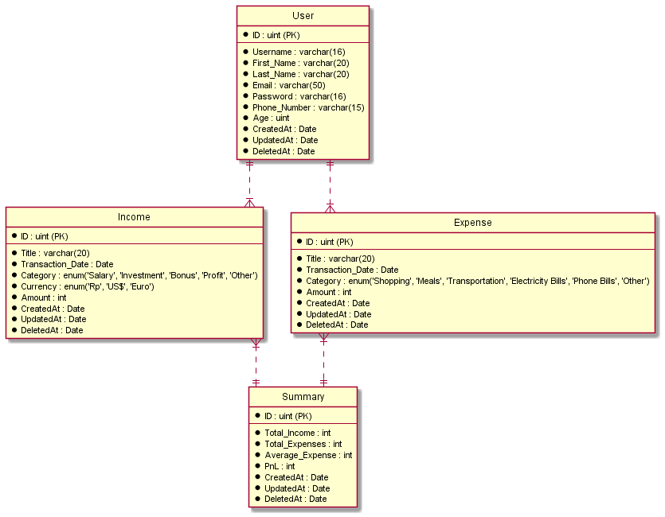

## CaseInCashOut API
This is the API for tracking our Daily Transaction (Income & Expense).

# Table of Contents
- [Entity Relations Diagram](#entity-relations-diagram)
- [Use Cae Diagram](#use-case-diagram)
- [Tech Stacks](#tech-stacks)
- [Features](#features)
- [How to use](#how-to-use)

# Entity Relations Diagram
This is the database entity that CashInCashOut have

# Use Case Diagram
This is the Use Case that CashInCashOut have

# Tech Stacks

<table>
	<tr>
		<td class="border_l border_r border_t border_b selected">
			

				

					
Programming Language

				

			

		</td>
	</tr>
	<tr>
		<td class="border_l border_r border_t border_b selected">
   			

      			

       				

					   	
       				

     			

    		

  		</td>
	</tr>
</table>
<table>
	<tr>
		<td class="border_l border_r border_t border_b selected">
			

				

					
Backend Development

				

			

		</td>
  	</tr>
 	<tr>
		<td class="border_l border_r border_t border_b selected">
			

				

					

						
						
					

				

			

		</td>
  	</tr>
</table>
<table>
	<tr>
		<td class="border_l border_r border_t border_b selected">
			

				

					
Tools

				

			

		</td>
	</tr>
	<tr>
		<td class="border_l border_r border_t border_b selected">
			

				

					

						
						
						
					

				

			

		</td>
	</tr>
</table>

# Features

|Features Name                         | Authorization   | Method    | Description                                    |
|--------------------------------------|-----------------|-----------|------------------------------------------------|
| User SignUp                          | No              |           | Feature for create user                        |
| User SignIn                          | No              |           | Feature for login into the application         |
| Get All Users                        | Yes             | JWT TOKEN | Feature for getting all users                  |
| Get Users by ID	     			   | Yes             | JWT TOKEN | Feature for getting user by id                 |
| Update User Profile                  | Yes             | JWT TOKEN | Feature for updating user profile              |
| Delete User Profile                  | Yes             | JWT TOKEN | Feature for deleting user profile              |
| Create Income         			   | Yes             | JWT TOKEN | Feature for creating Income                    |
| Get All Incomes                      | Yes             | JWT TOKEN | Feature for getting all Incomes                |
| Get Income by Category  			   | Yes             | JWT TOKEN | Feature for getting Income by category         |
| Update Income        			       | Yes             | JWT TOKEN | Feature for updating Income                    |
| Delete Income          			   | Yes             | JWT TOKEN | Feature for deleting Income                    |
| Create Expense         			   | Yes             | JWT TOKEN | Feature for creating Expense                   |
| Get All Expenses                     | Yes             | JWT TOKEN | Feature for getting all Expenses               |
| Get Expense by Category  			   | Yes             | JWT TOKEN | Feature for getting Expense by category        |
| Update Expense        		       | Yes             | JWT TOKEN | Feature for updating Expense                   |
| Delete Expense          			   | Yes             | JWT TOKEN | Feature for deleting Expense                   |

# How to Use